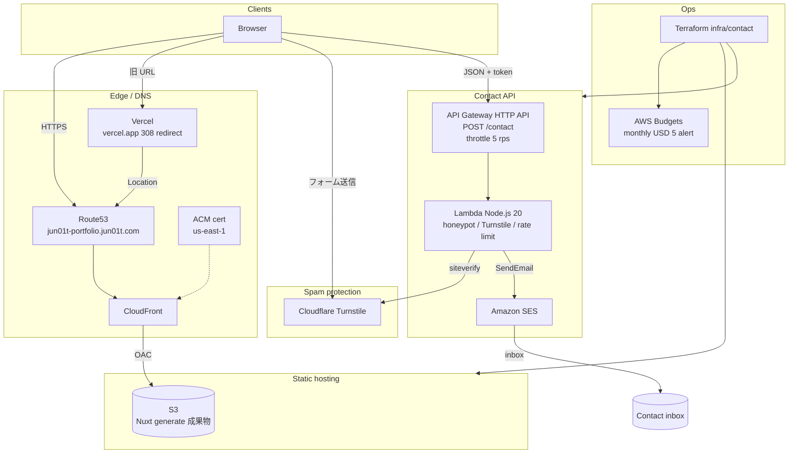

# jun01t Portfolio

Nuxt 3 静的サイト。ホスティングは **S3 + CloudFront**、お問い合わせは **SES（API Gateway + Lambda）**。

公開 URL: `https://jun01t-portfolio.jun01t.com`

## 成果と設計判断

- **静的配信**: サーバーレスで運用負荷を下げつつ、独自ドメイン（Route53 + ACM + CloudFront OAC）で配信する
- **お問い合わせ**: EmailJS 依存をやめ、API Gateway + Lambda + SES に移行。返信可能な `Reply-To` を維持する
- **スパム対策**: honeypot + Cloudflare Turnstile + 件名ホワイトリスト + IP レート制限
- **費用ガード**: API スロットル、Lambda 同時実行上限、月次 AWS Budgets（既定 USD 5）アラート
- **移行互換**: 旧 Vercel URL は AWS ドメインへ 308 リダイレクト
- **品質ゲート**: GitHub Actions で Gitleaks / lint / typecheck / build。Dependabot で依存更新

インフラ: [infra/contact/README.md](./infra/contact/README.md)  
環境変数: [ENVIRONMENT_SETUP.md](./ENVIRONMENT_SETUP.md)

## 構成図



**配信**: Nuxt 3 SPA（`pnpm generate`）→ S3 → CloudFront  
**お問い合わせ**: フォーム → Turnstile → API Gateway → Lambda → SES  
**旧 Vercel URL**: AWS ドメインへ恒久リダイレクト

パッケージマネージャは **pnpm**（`packageManager` で 9.15.9 を指定）。Node.js は **20+** が必要です。

```bash
nodebrew use v20          # PATH に nodebrew を通しておく
corepack enable
pnpm install
aws login                 # AWS 認証が切れている場合
pnpm run apply:infra      # Terraform apply + SES identity
# SES 検証メールを承認してから:
pnpm run deploy:aws       # generate → S3 sync → CloudFront invalidation
```

## Setup

```bash
nodebrew use v20
corepack enable
pnpm install
```

## Development Server

Start the development server on `http://localhost:3000`:

```bash
pnpm run dev
```

## Production

Build the application for production:

```bash
pnpm run build
```

Locally preview production build:

```bash
pnpm run preview
```

Check out the [deployment documentation](https://nuxt.com/docs/getting-started/deployment) for more information.
