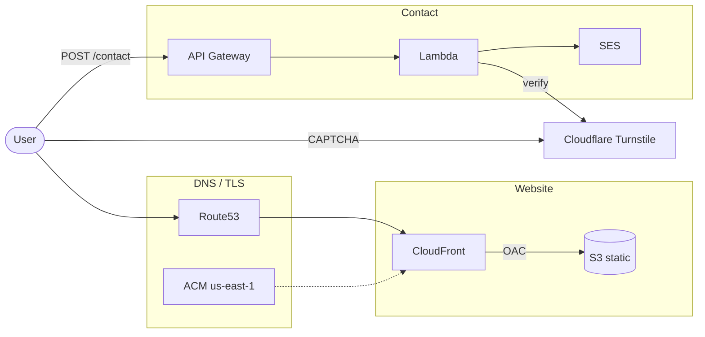
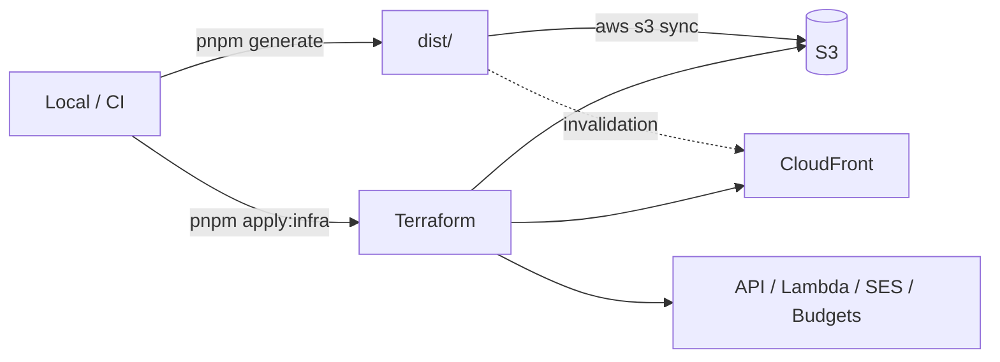

# Portfolio infra (S3 + CloudFront + SES contact API)

- **サイト**: S3 + CloudFront + ACM + Route53 → `https://jun01t-portfolio.jun01t.com`
- **お問い合わせ**: API Gateway + Lambda + SES
- **スパム対策**: honeypot + Cloudflare Turnstile（推奨）+ レート制限（主は API Gateway スロットル、Lambda 内 Map は補助）
- **費用ガード**: API スロットル、Lambda 同時実行上限、月次 Budgets アラート（既定 $5）

Vercel は使いません（`*.vercel.app` は AWS ドメインへ 308 リダイレクト）。

## 構成図



デプロイフロー:



## 前提

1. 有効な AWS 認証（期限切れならターミナルで `aws login`）
2. Route53 に `jun01t.com` ホストゾーンがあること
3. リポジトリルートで `pnpm install` 済みであること
4. （推奨）Cloudflare Turnstile の site / secret キー

## Turnstile キー

[Turnstile ダッシュボード](https://dash.cloudflare.com/?to=/:account/turnstile) で Widget を作成し、`terraform.tfvars` に設定:

```hcl
turnstile_site_key   = "..."
turnstile_secret_key = "..."
```

未設定でも honeypot のみで動作します。

## 1. Terraform apply

```bash
# リポジトリルートから
pnpm run apply:infra
```

手動の場合:

```bash
cd infra/contact/lambda && pnpm install --prod
cd ..
../../.bin/terraform init
../../.bin/terraform apply
```

apply 後:

1. `terraform.tfvars` の `from_email` に届く **SES 検証メール** のリンクを開く
2. output の `contact_api_url` / `s3_bucket_name` / `cloudfront_distribution_id` を控える

## 2. サイトをデプロイ

リポジトリルートで:

```bash
pnpm run deploy:aws
```

`deploy:aws` は `nuxt generate` → S3 sync → CloudFront invalidation を実行します。  
`TURNSTILE_SITE_KEY` も Terraform output から渡します。

`master` / `main` への push では GitHub Actions（`.github/workflows/deploy.yml`）が同じ処理を自動実行します。  
認証は GitHub OIDC（`jun01t-portfolio-github-deploy` ロール）で、アクセスキーは使いません。

### GitHub Actions Variables（必須）

リポジトリの **Settings → Secrets and variables → Actions → Variables** に設定します（ワークフローに直書きしません）:

| Variable | 例の取得元 |
| --- | --- |
| `AWS_REGION` | `ap-northeast-1` |
| `AWS_DEPLOY_ROLE_ARN` | `terraform output -raw github_deploy_role_arn` |
| `S3_BUCKET` | `terraform output -raw s3_bucket_name` |
| `CLOUDFRONT_DISTRIBUTION_ID` | `terraform output -raw cloudfront_distribution_id` |
| `CONTACT_API_URL` | `terraform output -raw contact_api_url` |
| `TURNSTILE_SITE_KEY` | `terraform output -raw turnstile_site_key`（任意だが推奨） |

OIDC プロバイダとロールを CLI で先に作っている場合、Terraform へ取り込むには:

```bash
cd infra/contact
ACCOUNT_ID="$(aws sts get-caller-identity --query Account --output text)"
../../.bin/terraform import aws_iam_openid_connect_provider.github \
  "arn:aws:iam::${ACCOUNT_ID}:oidc-provider/token.actions.githubusercontent.com"
../../.bin/terraform import aws_iam_role.github_deploy jun01t-portfolio-github-deploy
../../.bin/terraform import aws_iam_role_policy.github_deploy jun01t-portfolio-github-deploy:jun01t-portfolio-github-deploy
```

## 手動デプロイ例

```bash
export CONTACT_API_URL="$(cd infra/contact && ../../.bin/terraform output -raw contact_api_url)"
export TURNSTILE_SITE_KEY="$(cd infra/contact && ../../.bin/terraform output -raw turnstile_site_key)"
pnpm run generate
aws s3 sync dist/ "s3://$(cd infra/contact && ../../.bin/terraform output -raw s3_bucket_name)/" --delete
aws cloudfront create-invalidation \
  --distribution-id "$(cd infra/contact && ../../.bin/terraform output -raw cloudfront_distribution_id)" \
  --paths "/*"
```
